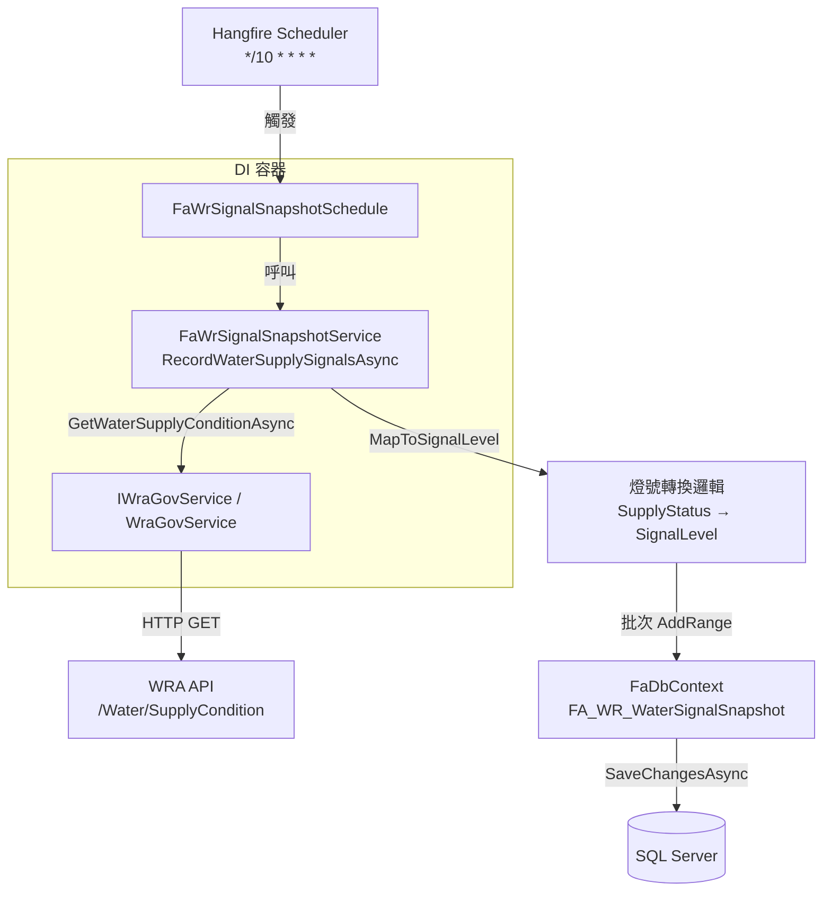

# 設計文件：供水狀態燈號定期記錄排程（water-signal-recorder）

## 概覽

本功能在現有 ASP.NET Core 3.1 Web API（fa_api）中新增一條 Hangfire 週期性排程，每 10 分鐘從水利署（WRA）API 抓取各地區供水狀況，將 `SupplyStatus` 代碼轉換為四色燈號（綠燈／黃燈／橙燈／紅燈），並以批次方式寫入新資料表 `FA_WR_WaterSignalSnapshot`，供歷史趨勢分析與前端查詢使用。

設計遵循專案現有慣例：
- 服務層：`Services/FaWrSignalSnapshot/` 資料夾，介面與實作分離
- 排程層：`Schedule/FaWrSignalSnapshotSchedule.cs`，對應 `MailSchedule.cs` 模式
- DI 註冊：集中於 `ServiceExtensions/DISetup.cs`
- 資料模型：`Models/FaWrWaterSignalSnapshot.cs` + `FaDbContext` 新增 `DbSet`
- SQL 腳本：`DocSQL/Step2_Create_WaterSignalSnapshot.sql`

---

## 架構



### 資料流

1. Hangfire 依 `*/10 * * * *` 觸發 `FaWrSignalSnapshotSchedule`
2. Schedule 呼叫 `FaWrSignalSnapshotService.RecordWaterSupplySignalsAsync()`
3. Service 產生新 `BatchId`（GUID），記錄開始時間
4. 呼叫 `IWraGovService.GetWaterSupplyConditionAsync()` 取得供水清單
5. 逐筆將 `SupplyStatus` 對應至 `SignalLevel`；無效值略過
6. 將所有有效紀錄 `AddRange` 至 DbContext，單次 `SaveChangesAsync()`
7. 記錄 BatchId、寫入筆數、執行時間至日誌

---

## 元件與介面

### IFaWrSignalSnapshotService

```csharp
namespace fa_api.Services.FaWrSignalSnapshot
{
    public interface IFaWrSignalSnapshotService
    {
        /// <summary>
        /// 抓取供水狀況、轉換燈號並批次寫入 FA_WR_WaterSignalSnapshot
        /// </summary>
        Task RecordWaterSupplySignalsAsync();
    }
}
```

### FaWrSignalSnapshotService

```csharp
namespace fa_api.Services.FaWrSignalSnapshot
{
    public class FaWrSignalSnapshotService : IFaWrSignalSnapshotService
    {
        private readonly IWraGovService _wraGovService;
        private readonly FaDbContext _dbContext;
        private readonly ILogger<FaWrSignalSnapshotService> _logger;

        public FaWrSignalSnapshotService(
            IWraGovService wraGovService,
            FaDbContext dbContext,
            ILogger<FaWrSignalSnapshotService> logger)
        { ... }

        public async Task RecordWaterSupplySignalsAsync() { ... }

        /// <summary>
        /// 將 SupplyStatus 對應至燈號字串；無效值回傳 null
        /// </summary>
        internal static string MapToSignalLevel(int supplyStatus) { ... }
    }
}
```

`MapToSignalLevel` 設計為 `internal static`，方便單元測試直接呼叫，不需要完整的 Service 實例。

### FaWrSignalSnapshotSchedule

```csharp
namespace fa_api.Schedule
{
    public class FaWrSignalSnapshotSchedule
    {
        private const string JobId = "water-signal-recorder";
        private const string CronExpression = "*/10 * * * *";

        private readonly IFaWrSignalSnapshotService _service;

        public FaWrSignalSnapshotSchedule(IFaWrSignalSnapshotService service) { ... }

        /// <summary>向 Hangfire 註冊週期性任務</summary>
        public void RegisterRecurringJob() { ... }

        /// <summary>移除週期性任務</summary>
        public void RemoveRecurringJob() { ... }

        /// <summary>立即排入一次執行（Fire-and-forget）</summary>
        public void EnqueueNow() { ... }
    }
}
```

---

## 資料模型

### FaWrWaterSignalSnapshot（EF Core 實體）

```csharp
// Models/FaWrWaterSignalSnapshot.cs
[Table("FA_WR_WaterSignalSnapshot")]
public partial class FaWrWaterSignalSnapshot
{
    [Key]
    public int Id { get; set; }

    [Required]
    [StringLength(36)]
    public string BatchId { get; set; }           // GUID，同批次共用

    [Required]
    [StringLength(100)]
    public string AreaName { get; set; }          // 地區名稱

    [Required]
    [StringLength(10)]
    public string SignalLevel { get; set; }       // 綠燈 / 黃燈 / 橙燈 / 紅燈

    public int SupplyStatus { get; set; }         // 原始供水狀態代碼（1-4）

    [StringLength(50)]
    public string StatusDescription { get; set; } // 供水狀態說明（nullable）

    [Column(TypeName = "datetime")]
    public DateTime RecordTime { get; set; }      // 預設 GETDATE()
}
```

### FaDbContext 異動

在 `FaDbContext` 新增：

```csharp
public virtual DbSet<FaWrWaterSignalSnapshot> FaWrWaterSignalSnapshot { get; set; }
```

在 `OnModelCreating` 新增：

```csharp
modelBuilder.Entity<FaWrWaterSignalSnapshot>(entity =>
{
    entity.HasIndex(e => e.BatchId);
    entity.HasIndex(e => e.RecordTime);
    entity.HasIndex(e => e.AreaName);

    entity.Property(e => e.RecordTime).HasDefaultValueSql("(getdate())");
});
```

### 燈號對應表

| SupplyStatus | 說明 | SignalLevel |
|:---:|---|:---:|
| 1 | 正常供水 | 綠燈 |
| 2 | 減壓供水 | 黃燈 |
| 3 | 限量供水 | 橙燈 |
| 4 | 停止供水 | 紅燈 |
| 其他 | 無效值 | 略過（不寫入） |

### SQL 建表腳本（DocSQL/Step2_Create_WaterSignalSnapshot.sql）

```sql
IF NOT EXISTS (SELECT 1 FROM sys.objects WHERE name = 'FA_WR_WaterSignalSnapshot' AND type = 'U')
BEGIN
    CREATE TABLE FA_WR_WaterSignalSnapshot (
        Id                INT           IDENTITY(1,1) PRIMARY KEY,
        BatchId           NVARCHAR(36)  NOT NULL,
        AreaName          NVARCHAR(100) NOT NULL,
        SignalLevel       NVARCHAR(10)  NOT NULL,
        SupplyStatus      INT           NOT NULL,
        StatusDescription NVARCHAR(50)  NULL,
        RecordTime        DATETIME      NOT NULL DEFAULT GETDATE(),

        CONSTRAINT CK_FA_WR_WaterSignalSnapshot_SignalLevel
            CHECK (SignalLevel IN (N'綠燈', N'黃燈', N'橙燈', N'紅燈'))
    );

    CREATE INDEX IX_FA_WR_WaterSignalSnapshot_BatchId    ON FA_WR_WaterSignalSnapshot(BatchId);
    CREATE INDEX IX_FA_WR_WaterSignalSnapshot_RecordTime ON FA_WR_WaterSignalSnapshot(RecordTime);
    CREATE INDEX IX_FA_WR_WaterSignalSnapshot_AreaName   ON FA_WR_WaterSignalSnapshot(AreaName);
END
```

---

## 正確性屬性

*屬性（Property）是在系統所有有效執行中都應成立的特性或行為——本質上是對系統應做什麼的形式化陳述。屬性作為人類可讀規格與機器可驗證正確性保證之間的橋樑。*

### 屬性 1：燈號對應完整性

*對任意* `SupplyStatus` 值屬於 `{1, 2, 3, 4}` 的供水紀錄，`MapToSignalLevel` 應回傳對應的非空燈號字串（`綠燈`、`黃燈`、`橙燈`、`紅燈`），且回傳值必須是這四個值之一。

**Validates: Requirements 1.2, 1.3, 1.4, 1.5**

---

### 屬性 2：無效狀態碼被略過

*對任意* 不在 `{1, 2, 3, 4}` 範圍內的整數 `SupplyStatus`，`MapToSignalLevel` 應回傳 `null`，且該筆資料不應出現在最終寫入的快照清單中。

**Validates: Requirements 1.6**

---

### 屬性 3：快照欄位完整性

*對任意* 包含一或多筆有效供水狀況（`SupplyStatus` 在 1-4 之間）的輸入清單，執行 `RecordWaterSupplySignalsAsync()` 後，每一筆產生的 `FaWrWaterSignalSnapshot` 都應包含非空的 `AreaName`、`SignalLevel`、`BatchId`，以及正確的 `SupplyStatus` 原始值。

**Validates: Requirements 1.7**

---

### 屬性 4：同批次 BatchId 一致性

*對任意* 包含多筆有效供水狀況的輸入清單，單次執行 `RecordWaterSupplySignalsAsync()` 所產生的所有快照紀錄，應共用同一個 `BatchId`（有效 GUID 格式），且不同次執行的 `BatchId` 應不同。

**Validates: Requirements 2.1**

---

## 錯誤處理

### API 呼叫失敗（需求 2.3）

`GetWaterSupplyConditionAsync()` 拋出例外時：
- 以 `_logger.LogError` 記錄例外訊息與 stack trace
- 重新拋出例外，讓 Hangfire 依其預設重試策略（10 次，指數退避）處理
- 不寫入任何資料至資料庫

### 資料庫寫入失敗（需求 2.4）

`SaveChangesAsync()` 拋出例外時：
- 以 `_logger.LogError` 記錄例外訊息、BatchId 及預計寫入筆數
- 重新拋出例外，讓 Hangfire 處理重試
- EF Core 的 `AddRange` 在 `SaveChangesAsync` 失敗時不會部分寫入（交易語意）

### 無效 SupplyStatus（需求 1.6）

- 以 `_logger.LogWarning` 記錄略過的地區名稱與原始 `SupplyStatus` 值
- 繼續處理其餘有效紀錄，不中斷整批執行

### 執行完成日誌（需求 2.5）

每次成功執行後記錄：
```
[FaWrSignalSnapshot] BatchId={guid}, 寫入筆數={n}, 執行時間={ms}ms
```

---

## 測試策略

### 單元測試

測試目標為純邏輯層，使用 mock 隔離外部依賴。

**MapToSignalLevel（靜態方法）**
- 驗證 SupplyStatus 1→4 各自對應正確燈號（example-based）
- 驗證邊界值（0、5、-1、int.MinValue、int.MaxValue）回傳 null

**RecordWaterSupplySignalsAsync**
- 驗證 `GetWaterSupplyConditionAsync()` 被呼叫一次（mock IWraGovService）
- 驗證 `SaveChangesAsync()` 被呼叫一次，無論輸入筆數多寡（mock FaDbContext）
- 驗證 API 拋出例外時，`SaveChangesAsync` 不被呼叫且例外向上傳遞
- 驗證 `SaveChangesAsync` 拋出例外時，例外向上傳遞

### 屬性測試（Property-Based Testing）

使用 **FsCheck**（.NET 的 property-based testing 函式庫）。每個屬性測試執行最少 **100 次**迭代。

| 屬性 | 測試標籤 |
|------|---------|
| 屬性 1：燈號對應完整性 | `Feature: water-signal-recorder, Property 1: 燈號對應完整性` |
| 屬性 2：無效狀態碼被略過 | `Feature: water-signal-recorder, Property 2: 無效狀態碼被略過` |
| 屬性 3：快照欄位完整性 | `Feature: water-signal-recorder, Property 3: 快照欄位完整性` |
| 屬性 4：同批次 BatchId 一致性 | `Feature: water-signal-recorder, Property 4: 同批次 BatchId 一致性` |

屬性 1 與 2 直接測試 `MapToSignalLevel` 靜態方法（純函式，無外部依賴）。
屬性 3 與 4 使用 mock FaDbContext，捕捉 `AddRange` 的輸入進行驗證，不實際連接資料庫。

### 整合測試

- 驗證 Hangfire 排程以正確 Cron 表達式和 Job ID 完成註冊（需要 Hangfire 記憶體儲存）
- 驗證 DI 容器能正確解析 `IFaWrSignalSnapshotService` 與 `FaWrSignalSnapshotSchedule`

### 不適用 PBT 的部分

排程註冊（需求 3）、資料表結構（需求 4）、DI 設定（需求 5）均屬基礎設施配置，行為不隨輸入變化，以 smoke test 驗證即可。
