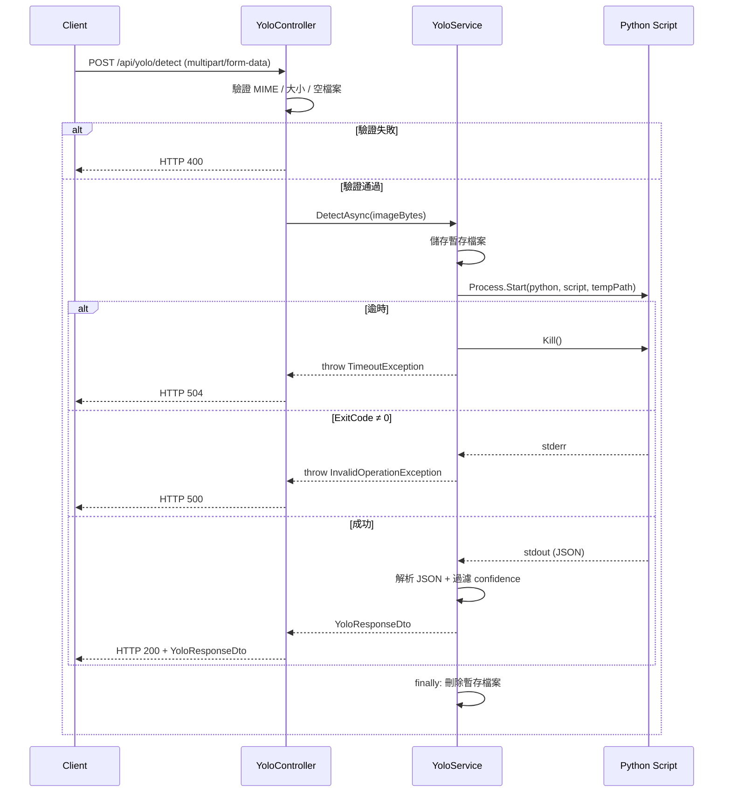

# Design Document

## Feature: yolo-image-recognition

---

## Overview

本功能在現有的 `fa_api` ASP.NET Core 3.1 Web API 專案中，新增 YOLO 影像辨識能力。
架構遵循專案現有慣例：`Controllers` → `Services/Yolo` → `Dtos/Yolo`，
透過 `Process.Start` 呼叫本機 Python 腳本執行 YOLO 模型推論，
辨識結果以 JSON 格式回傳後包裝成標準 DTO 回應給前端。

**核心流程：**

```
Client (multipart/form-data)
  → YoloController (驗證 MIME / 大小)
    → YoloService (儲存暫存檔 → Process.Start Python → 解析 stdout JSON)
      → DetectionResultDto[] + elapsedMs
    → YoloResponseDto (HTTP 200)
```

**設計決策：**

- 使用 `Process.Start` 而非 HTTP 呼叫 Python，因為 Python 腳本在本機執行，無需網路開銷，且與現有架構（無 Python HTTP server 依賴）一致。
- 暫存檔案使用 `Path.GetTempFileName()` 確保唯一性，並在 `finally` 區塊中刪除，保證清理不受例外影響。
- `YoloSettings` 透過 `IOptions<YoloSettings>` 注入，與現有 `SmtpSettings` 模式一致。
- Confidence 過濾在 Service 層完成，Controller 不感知此邏輯。

---

## Architecture

```
┌─────────────────────────────────────────────────────────────┐
│                        fa_api                               │
│                                                             │
│  Controllers/                                               │
│  └── YoloController.cs                                      │
│       ├── POST /api/yolo/detect                             │
│       ├── 驗證：MIME 類型、檔案大小、空檔案                    │
│       └── 例外處理：TimeoutException → 504, Exception → 500  │
│                                                             │
│  Services/Yolo/                                             │
│  ├── IYoloService.cs                                        │
│  └── YoloService.cs                                         │
│       ├── 儲存暫存影像檔案                                    │
│       ├── Process.Start(PythonPath, ScriptPath + tempPath)  │
│       ├── 等待逾時（TimeoutSeconds）                          │
│       ├── 解析 stdout JSON → DetectionResultDto[]           │
│       ├── 過濾 confidence 範圍 [0.0, 1.0]                   │
│       └── finally: 刪除暫存檔案                              │
│                                                             │
│  Dtos/Yolo/                                                 │
│  └── YoloDto.cs                                             │
│       ├── DetectionResultDto                                │
│       └── YoloResponseDto                                   │
│                                                             │
│  Services/Yolo/                                             │
│  └── YoloSettings.cs                                        │
│       ├── PythonPath                                        │
│       ├── ScriptPath                                        │
│       └── TimeoutSeconds (預設 30)                          │
│                                                             │
│  ServiceExtensions/DISetup.cs                               │
│  └── AddScoped<IYoloService, YoloService>()                 │
│      Configure<YoloSettings>("YoloSettings")                │
└─────────────────────────────────────────────────────────────┘
         │
         │ Process.Start
         ▼
┌─────────────────────────────────────────────────────────────┐
│  Python YOLO Script (本機)                                   │
│  argv[1]: script_path                                       │
│  argv[2]: temp_image_path                                   │
│  stdout:  JSON array of detection results                   │
│  stderr:  error message (on failure)                        │
│  exit 0:  success                                           │
│  exit ≠0: failure                                           │
└─────────────────────────────────────────────────────────────┘
```

---

## Components and Interfaces

### YoloController

```csharp
[ApiController]
[Route("api/[controller]")]
[ApiExplorerSettings(GroupName = "Yolo")]
[Produces("application/json")]
public class YoloController : ControllerBase
{
    // 建構子注入
    public YoloController(ILogger<YoloController> logger, IYoloService yoloService)

    // POST /api/yolo/detect
    // 接受 multipart/form-data，欄位名稱 "image"
    [HttpPost("detect")]
    public async Task<ActionResult<YoloResponseDto>> Detect([FromForm] IFormFile image)
}
```

**驗證邏輯（依序）：**
1. `image == null || image.Length == 0` → HTTP 400 `{ "message": "影像檔案不得為空" }`
2. MIME 類型不在 `{ "image/jpeg", "image/png", "image/bmp" }` → HTTP 400 `{ "message": "不支援的檔案格式，僅接受 JPEG、PNG、BMP" }`
3. `image.Length > 10 * 1024 * 1024` → HTTP 400 `{ "message": "檔案大小超過限制（最大 10 MB）" }`

**例外處理：**
- `TimeoutException` → HTTP 504 `{ "message": "影像辨識逾時，請稍後再試" }`
- 其他 `Exception` → `_logger.LogError(ex, ...)` + HTTP 500 `{ "message": "影像辨識失敗", "error": "{ex.Message}" }`

> 注意：`YoloController` 不注入 `IMemoryCache`，因為影像辨識結果不適合快取（每次影像內容不同）。

---

### IYoloService

```csharp
namespace fa_api.Services.Yolo
{
    public interface IYoloService
    {
        /// <summary>
        /// 執行 YOLO 影像辨識，回傳偵測結果與執行時間。
        /// </summary>
        /// <param name="imageBytes">影像位元組陣列</param>
        /// <returns>YoloResponseDto 包含偵測結果清單與執行時間（毫秒）</returns>
        /// <exception cref="TimeoutException">Python 腳本執行逾時</exception>
        /// <exception cref="InvalidOperationException">腳本執行失敗或設定不完整</exception>
        Task<YoloResponseDto> DetectAsync(byte[] imageBytes);
    }
}
```

---

### YoloService

```csharp
namespace fa_api.Services.Yolo
{
    public class YoloService : IYoloService
    {
        private readonly ILogger<YoloService> _logger;
        private readonly YoloSettings _settings;

        public YoloService(ILogger<YoloService> logger, IOptions<YoloSettings> settings)

        public async Task<YoloResponseDto> DetectAsync(byte[] imageBytes)
        {
            // 1. 驗證設定完整性
            // 2. 儲存暫存檔案（Path.GetTempFileName() + 副檔名）
            // 3. LogDebug：Python 路徑、腳本路徑、暫存路徑
            // 4. Process.Start，重導向 stdout/stderr
            // 5. 等待逾時（WaitForExitAsync + CancellationToken）
            // 6. 逾時 → Kill process → throw TimeoutException
            // 7. ExitCode != 0 → 讀 stderr → throw InvalidOperationException
            // 8. 讀 stdout → 解析 JSON → 過濾 confidence
            // 9. LogInformation：偵測數量、執行時間
            // 10. finally: 刪除暫存檔案
        }

        // 私有輔助方法
        private List<DetectionResultDto> ParseDetections(string json)
        private void DeleteTempFile(string path)
    }
}
```

**Process 呼叫方式：**

```csharp
var psi = new ProcessStartInfo
{
    FileName = _settings.PythonPath,
    Arguments = $"\"{_settings.ScriptPath}\" \"{tempImagePath}\"",
    RedirectStandardOutput = true,
    RedirectStandardError = true,
    UseShellExecute = false,
    CreateNoWindow = true
};
```

**逾時處理策略：**

使用 `CancellationTokenSource` 搭配 `process.WaitForExitAsync(cts.Token)`。
若 `CancellationToken` 觸發，立即呼叫 `process.Kill(entireProcessTree: true)` 後拋出 `TimeoutException`。
即使腳本恰好在逾時當下完成，只要 token 已取消，仍視為逾時（符合需求 2.2 的嚴格語意）。

---

### YoloSettings

```csharp
namespace fa_api.Services.Yolo
{
    public class YoloSettings
    {
        /// <summary>Python 執行檔路徑（例：python 或 /usr/bin/python3）</summary>
        public string PythonPath { get; set; }

        /// <summary>YOLO Python 腳本路徑</summary>
        public string ScriptPath { get; set; }

        /// <summary>腳本執行逾時秒數（預設 30）</summary>
        public int TimeoutSeconds { get; set; } = 30;
    }
}
```

**appsettings.json 範例：**

```json
{
  "YoloSettings": {
    "PythonPath": "python",
    "ScriptPath": "C:\\scripts\\yolo_detect.py",
    "TimeoutSeconds": 30
  }
}
```

---

## Data Models

### DetectionResultDto

```csharp
namespace fa_api.Dtos.Yolo
{
    /// <summary>單一物件偵測結果</summary>
    public class DetectionResultDto
    {
        /// <summary>物件類別名稱（例：person、car）</summary>
        public string Label { get; set; }

        /// <summary>信心分數（0.0 ~ 1.0）</summary>
        public decimal Confidence { get; set; }

        /// <summary>邊界框左上角 X 座標（像素）</summary>
        public int X { get; set; }

        /// <summary>邊界框左上角 Y 座標（像素）</summary>
        public int Y { get; set; }

        /// <summary>邊界框寬度（像素）</summary>
        public int Width { get; set; }

        /// <summary>邊界框高度（像素）</summary>
        public int Height { get; set; }
    }
}
```

### YoloResponseDto

```csharp
namespace fa_api.Dtos.Yolo
{
    /// <summary>YOLO 影像辨識完整回應</summary>
    public class YoloResponseDto
    {
        /// <summary>偵測到的物件清單（可為空陣列）</summary>
        public List<DetectionResultDto> Detections { get; set; }

        /// <summary>本次辨識執行時間（毫秒）</summary>
        public int ElapsedMs { get; set; }
    }
}
```

### Python 腳本輸出 JSON 格式（預期）

```json
[
  {
    "label": "person",
    "confidence": 0.92,
    "x": 120,
    "y": 45,
    "width": 80,
    "height": 200
  },
  {
    "label": "car",
    "confidence": 0.87,
    "x": 300,
    "y": 150,
    "width": 120,
    "height": 70
  }
]
```

### DI 與設定整合

`DISetup.cs` 新增：

```csharp
// ========== YOLO 服務 ==========
services.Configure<YoloSettings>(configuration.GetSection("YoloSettings"));
services.AddScoped<IYoloService, YoloService>();
```

---

## Correctness Properties

*A property is a characteristic or behavior that should hold true across all valid executions of a system — essentially, a formal statement about what the system should do. Properties serve as the bridge between human-readable specifications and machine-verifiable correctness guarantees.*

### Property 1: MIME 類型驗證拒絕非允許格式

*For any* MIME type string that is not one of `"image/jpeg"`, `"image/png"`, `"image/bmp"`, the controller SHALL reject the request with HTTP 400; and for any of those three allowed MIME types, the request SHALL proceed past validation.

**Validates: Requirements 1.2**

---

### Property 2: 檔案大小驗證拒絕超過上限的檔案

*For any* file size in bytes, if the size exceeds 10 × 1024 × 1024 bytes (10 MB), the controller SHALL reject the request with HTTP 400; if the size is within the limit (and non-zero), the request SHALL proceed past size validation.

**Validates: Requirements 1.3**

---

### Property 3: 偵測結果解析完整性（解析 Round-Trip）

*For any* JSON array of detection result objects containing `label`, `confidence`, `x`, `y`, `width`, `height` fields with valid values, parsing the JSON SHALL produce a `DetectionResultDto` list where each item's fields exactly match the corresponding JSON values — no fields are dropped, renamed, or mistyped.

**Validates: Requirements 2.3, 3.1**

---

### Property 4: Confidence 過濾不變式

*For any* list of detection result JSON objects containing confidence values (including values < 0.0 and > 1.0), the parsed `DetectionResultDto` list SHALL contain only items whose confidence is in the range [0.0, 1.0] inclusive; no item with confidence outside this range SHALL appear in the result.

**Validates: Requirements 3.3**

---

### Property 5: 暫存檔案清理不變式

*For any* execution outcome of `YoloService.DetectAsync` — whether the Python script succeeds (exit code 0), fails (non-zero exit code), or times out — the temporary image file created at the start of the method SHALL be deleted by the time the method returns or throws.

**Validates: Requirements 2.5**

---

## Error Handling

### Controller 層

| 情境 | HTTP 狀態碼 | 回應格式 |
|------|------------|---------|
| 影像為空（長度 0） | 400 | `{ "message": "影像檔案不得為空" }` |
| 不支援的 MIME 類型 | 400 | `{ "message": "不支援的檔案格式，僅接受 JPEG、PNG、BMP" }` |
| 檔案超過 10 MB | 400 | `{ "message": "檔案大小超過限制（最大 10 MB）" }` |
| `TimeoutException` | 504 | `{ "message": "影像辨識逾時，請稍後再試" }` |
| 其他例外 | 500 | `{ "message": "影像辨識失敗", "error": "{ex.Message}" }` |

### Service 層

| 情境 | 行為 |
|------|------|
| `PythonPath` 或 `ScriptPath` 為空 | 拋出 `InvalidOperationException("YoloSettings 設定不完整，請確認 PythonPath 與 ScriptPath")` |
| Python 腳本逾時 | Kill process → 拋出 `TimeoutException("YOLO 腳本執行逾時")` |
| Python 腳本 ExitCode ≠ 0 | 讀取 stderr → 拋出 `InvalidOperationException("YOLO 腳本執行失敗：{stderr}")` |
| stdout JSON 解析失敗 | 拋出 `InvalidOperationException`（Newtonsoft.Json 解析例外向上傳遞） |
| 暫存檔案刪除失敗 | `LogWarning` 記錄，不拋出例外（避免遮蔽主要結果） |

### 序列圖



---

## Testing Strategy

### 測試方法

本功能採用雙軌測試策略：

- **單元測試（Example-based）**：驗證具體情境、邊界條件與錯誤處理
- **屬性測試（Property-based）**：驗證跨輸入空間的普遍不變式

### 屬性測試

使用 [FsCheck](https://fscheck.github.io/FsCheck/) 作為 .NET 的屬性測試函式庫（與 xUnit 整合）。
每個屬性測試最少執行 **100 次迭代**。

| 屬性 | 測試重點 | 生成器 |
|------|---------|--------|
| Property 1: MIME 驗證 | 任意 MIME 字串 → 只有 3 種通過 | 隨機字串 + 允許清單內的值 |
| Property 2: 大小驗證 | 任意檔案大小 → >10MB 被拒絕 | 0 ~ 20MB 的整數 |
| Property 3: 解析完整性 | 任意偵測結果 JSON → 欄位完整對應 | 隨機 label/confidence/座標 |
| Property 4: Confidence 過濾 | 任意 confidence 值 → 只有 [0.0,1.0] 通過 | 包含負數與 >1.0 的 decimal |
| Property 5: 暫存檔清理 | 任意執行結果 → 暫存檔被刪除 | 模擬成功/失敗/逾時三種結果 |

每個屬性測試標記格式：
```
// Feature: yolo-image-recognition, Property {N}: {property_text}
```

### 單元測試（Example-based）

| 測試情境 | 驗證重點 |
|---------|---------|
| 空檔案上傳 | HTTP 400 + 正確訊息 |
| 不支援 MIME 類型 | HTTP 400 + 正確訊息 |
| 超過 10 MB | HTTP 400 + 正確訊息 |
| 成功辨識 | HTTP 200 + YoloResponseDto 結構 |
| TimeoutException | HTTP 504 + 正確訊息 |
| 一般例外 | HTTP 500 + LogError 呼叫 |
| ExitCode ≠ 0 | InvalidOperationException + stderr 訊息 |
| 設定不完整 | InvalidOperationException + 正確訊息 |
| 空偵測陣列 | detections 為空陣列（非 null，非錯誤） |
| LogInformation 記錄 | 成功後記錄偵測數量與執行時間 |
| LogDebug 記錄 | 呼叫前記錄路徑資訊 |
| Swagger 屬性 | Controller 具備正確 Attribute |

### 整合測試 / Smoke Tests

| 測試 | 類型 | 說明 |
|------|------|------|
| DI 容器解析 | Smoke | `IYoloService` 能從容器解析為 `YoloService` |
| 設定綁定 | Smoke | `YoloSettings` 正確從 `appsettings.json` 讀取 |
| 開發環境覆蓋 | Smoke | `appsettings.Development.json` 覆蓋基本設定 |

### 測試框架建議

- **xUnit** — 主要測試框架（與現有 .NET Core 3.1 相容）
- **FsCheck.Xunit** — 屬性測試整合
- **Moq** — Mock `IYoloService`、`ILogger`、`IOptions<YoloSettings>`
- **Microsoft.AspNetCore.Mvc.Testing** — Controller 整合測試
