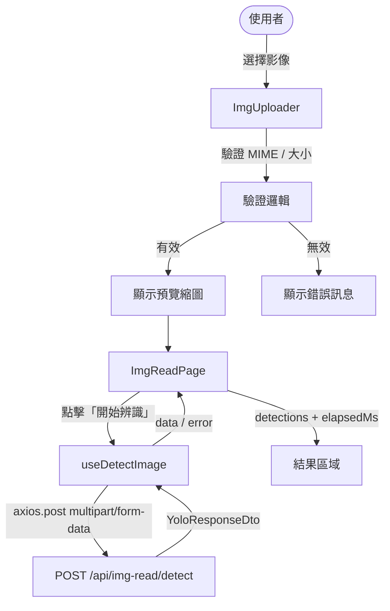

# 設計文件：ImgRead 影像辨識模組

## 概覽

ImgRead 模組讓內部人員能夠上傳影像並透過後端 YOLO 物件偵測 API 執行自動辨識，在頁面上呈現偵測結果清單與執行時間。

本模組遵循專案現有技術堆疊與慣例：
- React 18 + Ant Design v5
- react-query v3（`useMutation`）
- axios 直接使用（不透過 `apiClient`），搭配 `process.env.REACT_APP_API_BASE_URL`
- prop-types 宣告所有元件 props

---

## 架構

### 整體資料流



### 模組分層

```
src/
├── libs/
│   └── imgRead/
│       └── imgRead.js          ← Detect_Hook（useDetectImage）
├── api/
│   └── queries.js              ← 重新匯出 useDetectImage
├── pages/
│   └── imgRead/
│       ├── ImgReadPage.js      ← 主頁面元件
│       └── components/
│           └── ImgUploader.js  ← 上傳子元件
└── routes/
    └── AppRoutes.js            ← 新增 /img-read 路由
```

---

## 元件與介面

### ImgReadPage（`src/pages/imgRead/ImgReadPage.js`）

主頁面元件，負責：
- 持有 `selectedFile` 狀態（`useState<File | null>`）
- 呼叫 `useDetectImage` hook
- 根據 `isLoading` / `error` / `data` 控制 UI 狀態
- 渲染 `ImgUploader`、「開始辨識」按鈕、結果區域

**Props：** 無（此頁面為路由層級元件，不接收 props）

**內部狀態：**

| 狀態 | 型別 | 說明 |
|---|---|---|
| `selectedFile` | `File \| null` | 使用者選擇的有效影像檔案 |

**使用的 hook：**

```js
const { mutate, isLoading, data, error, reset } = useDetectImage();
```

**錯誤判斷邏輯：**

```js
// HTTP 錯誤（4xx / 5xx）
if (error?.response) {
  message.error('辨識失敗，請稍後再試');
}
// 網路錯誤 / 逾時
else if (error?.request || error?.code === 'ECONNABORTED') {
  message.error('網路錯誤，請確認連線後重試');
}
```

---

### ImgUploader（`src/pages/imgRead/components/ImgUploader.js`）

負責影像選擇、驗證與預覽的子元件，使用 Ant Design `Upload` 元件（`beforeUpload` 攔截，`customRequest` 阻止自動上傳）。

**Props：**

| Prop | 型別 | 必填 | 說明 |
|---|---|---|---|
| `onFileSelect` | `func` | ✓ | 有效檔案選擇後的回呼，傳入 `File` 物件 |
| `onFileRemove` | `func` | | 清除檔案時的回呼 |
| `disabled` | `bool` | | 是否停用上傳區域（送出期間） |

**defaultProps：**

```js
ImgUploader.defaultProps = {
  onFileRemove: () => {},
  disabled: false,
};
```

**驗證常數：**

```js
const ALLOWED_MIME_TYPES = ['image/jpeg', 'image/png', 'image/bmp'];
const MAX_FILE_SIZE = 10 * 1024 * 1024; // 10 MB
```

**驗證函式（純函式，可獨立測試）：**

```js
// 驗證 MIME type
export const isValidMimeType = (mimeType) =>
  ALLOWED_MIME_TYPES.includes(mimeType);

// 驗證檔案大小
export const isValidFileSize = (sizeInBytes) =>
  sizeInBytes <= MAX_FILE_SIZE;

// 格式化 confidence 為百分比字串
export const formatConfidence = (confidence) =>
  `${(confidence * 100).toFixed(2)}%`;

// 格式化執行時間
export const formatElapsedMs = (elapsedMs) =>
  `辨識耗時：${elapsedMs} ms`;
```

> 這四個純函式從 `ImgUploader.js` 具名匯出，供測試直接 import。

**預覽縮圖：** 使用 `URL.createObjectURL(file)` 產生 object URL，以 `` 元素顯示，CSS 設定 `min-width: 100px; min-height: 100px; object-fit: contain;`。

---

### useDetectImage（`src/libs/imgRead/imgRead.js`）

封裝 YOLO API 呼叫的 React Query mutation hook。

**介面：**

```js
export const useDetectImage = () => useMutation(detectImage);

// mutation function
const detectImage = async (file) => {
  const formData = new FormData();
  formData.append('image', file);

  const baseURL = process.env.REACT_APP_API_BASE_URL || 'http://localhost:65326';
  const response = await axios.post(
    `${baseURL}/api/img-read/detect`,
    formData,
    { headers: { 'Content-Type': 'multipart/form-data' } }
  );
  return response.data;
};
```

**回傳值：**

| 屬性 | 型別 | 說明 |
|---|---|---|
| `mutate` | `func` | 觸發偵測，傳入 `File` 物件 |
| `isLoading` | `bool` | 請求進行中 |
| `data` | `YoloResponseDto \| undefined` | 成功回傳的資料 |
| `error` | `AxiosError \| null` | 錯誤物件 |
| `reset` | `func` | 重置 mutation 狀態 |

---

## 資料模型

### YoloResponseDto

後端 `POST /api/img-read/detect` 的回傳結構：

```js
/**
 * @typedef {Object} BoundingBox
 * @property {number} x      - 左上角 x 座標（像素整數）
 * @property {number} y      - 左上角 y 座標（像素整數）
 * @property {number} width  - 寬度（像素整數）
 * @property {number} height - 高度（像素整數）
 */

/**
 * @typedef {Object} DetectionResult
 * @property {string} label      - 類別標籤
 * @property {number} confidence - 信心分數（0~1 之間的浮點數）
 * @property {BoundingBox} bbox  - 邊界框座標
 */

/**
 * @typedef {Object} YoloResponseDto
 * @property {DetectionResult[]} detections - 偵測結果陣列（可為空陣列）
 * @property {number} elapsedMs             - 執行時間（毫秒）
 */
```

### Ant Design Table 欄位定義

```js
const columns = [
  { title: '類別標籤', dataIndex: 'label', key: 'label' },
  {
    title: '信心分數',
    dataIndex: 'confidence',
    key: 'confidence',
    render: (val) => formatConfidence(val),  // e.g. "85.42%"
  },
  { title: 'X', dataIndex: ['bbox', 'x'], key: 'x' },
  { title: 'Y', dataIndex: ['bbox', 'y'], key: 'y' },
  { title: '寬度', dataIndex: ['bbox', 'width'], key: 'width' },
  { title: '高度', dataIndex: ['bbox', 'height'], key: 'height' },
];
```

`rowKey` 使用 `(record, index) => index`（後端未提供唯一 ID）。

---

## 正確性屬性

*屬性（Property）是在系統所有有效執行中都應成立的特性或行為——本質上是對系統應做什麼的形式化陳述。屬性作為人類可讀規格與機器可驗證正確性保證之間的橋樑。*

### 屬性 1：MIME type 驗證的完備性

*對任意* MIME type 字串，`isValidMimeType` 函式應只對 `image/jpeg`、`image/png`、`image/bmp` 回傳 `true`，對其他任意字串回傳 `false`。

**Validates: Requirements 1.2**

---

### 屬性 2：檔案大小驗證的邊界正確性

*對任意* 非負整數 `size`，`isValidFileSize(size)` 應在 `size <= 10 * 1024 * 1024` 時回傳 `true`，否則回傳 `false`。

**Validates: Requirements 1.3**

---

### 屬性 3：按鈕啟用狀態與有效檔案的對應關係

*對任意* 元件狀態，「開始辨識」按鈕的 `disabled` 屬性應恰好等於 `selectedFile === null`（即有有效檔案時啟用，否則停用）。

**Validates: Requirements 2.1, 2.2**

---

### 屬性 4：FormData 建構正確性

*對任意* `File` 物件，呼叫 `detectImage(file)` 時，傳遞給 `axios.post` 的 `FormData` 應包含欄位名稱為 `image`、值為該 `File` 物件的項目。

**Validates: Requirements 2.3, 4.3, 4.4**

---

### 屬性 5：confidence 格式化的正確性

*對任意* 0 到 1 之間的浮點數 `confidence`，`formatConfidence(confidence)` 應回傳格式為 `"XX.XX%"` 的字串，其數值等於 `(confidence * 100).toFixed(2)`。

**Validates: Requirements 3.1**

---

### 屬性 6：elapsedMs 格式化的正確性

*對任意* 非負整數 `elapsedMs`，`formatElapsedMs(elapsedMs)` 應回傳字串 `"辨識耗時：{elapsedMs} ms"`，其中 `{elapsedMs}` 為傳入的數值。

**Validates: Requirements 3.2**

---

### 屬性 7：物件總數顯示與陣列長度的一致性

*對任意* 長度大於 0 的 `detections` 陣列，頁面顯示的物件總數文字中的數字 `n` 應恰好等於 `detections.length`。

**Validates: Requirements 3.4**

---

## 錯誤處理

### 驗證錯誤（前端）

| 情境 | 處理方式 |
|---|---|
| MIME type 不符 | 顯示「僅支援 JPEG、PNG、BMP 格式」，清除 `selectedFile` 與預覽 |
| 檔案大小超過 10 MB | 顯示「檔案大小不得超過 10 MB」，清除 `selectedFile` 與預覽 |

錯誤訊息透過 Ant Design `message.warning` 顯示（驗證錯誤屬於使用者操作問題，非系統錯誤）。

### API 錯誤（後端）

| 情境 | 判斷條件 | 訊息 |
|---|---|---|
| HTTP 4xx / 5xx | `error.response` 存在 | 「辨識失敗，請稍後再試」 |
| 網路中斷 / 逾時 | `error.request` 存在或 `error.code === 'ECONNABORTED'` | 「網路錯誤，請確認連線後重試」 |

API 錯誤透過 Ant Design `message.error` 顯示。

### 空結果

`detections` 為空陣列時，顯示「未偵測到任何物件」提示，不顯示 Table 與物件總數行。

---

## 測試策略

### 適用性評估

本模組包含多個純函式（`isValidMimeType`、`isValidFileSize`、`formatConfidence`、`formatElapsedMs`）以及具有通用輸入/輸出行為的邏輯（FormData 建構、按鈕狀態），適合使用屬性測試。UI 渲染與路由整合部分使用 example-based 測試。

### 屬性測試（Property-Based Testing）

使用 **fast-check**（`npm install --save-dev fast-check`）進行屬性測試，每個屬性測試執行最少 100 次迭代。

測試檔案位置：`src/libs/imgRead/__tests__/imgRead.property.test.js`

```js
// 標籤格式：Feature: img-read, Property {n}: {property_text}
```

| 屬性 | 測試描述 | 生成器 |
|---|---|---|
| 屬性 1 | MIME type 驗證完備性 | `fc.string()` 生成任意字串 |
| 屬性 2 | 檔案大小驗證邊界 | `fc.nat()` 生成任意非負整數 |
| 屬性 3 | 按鈕啟用狀態對應 | `fc.boolean()` 模擬 hasValidFile |
| 屬性 4 | FormData 建構正確性 | `fc.string()` 生成 filename，mock axios |
| 屬性 5 | confidence 格式化 | `fc.float({ min: 0, max: 1 })` |
| 屬性 6 | elapsedMs 格式化 | `fc.nat()` 生成非負整數 |
| 屬性 7 | 物件總數顯示一致性 | `fc.array(fc.record({...}), { minLength: 1 })` |

### 單元測試（Example-Based）

使用 **@testing-library/react** + **jest**，測試檔案位置：`src/pages/imgRead/__tests__/`

| 測試案例 | 說明 |
|---|---|
| 初始渲染 | 結果區域不顯示，按鈕 disabled |
| 選擇無效 MIME type | 顯示正確錯誤訊息，selectedFile 為 null |
| 選擇超過 10 MB 檔案 | 顯示正確錯誤訊息，selectedFile 為 null |
| 選擇有效檔案 | 預覽縮圖出現，按鈕 enabled |
| 點擊「開始辨識」 | mutate 被呼叫，按鈕進入 loading 狀態 |
| API 成功（有結果） | Table 顯示，物件總數顯示，執行時間顯示 |
| API 成功（空結果） | 顯示「未偵測到任何物件」，無 Table |
| API HTTP 錯誤 | message.error 顯示「辨識失敗，請稍後再試」 |
| API 網路錯誤 | message.error 顯示「網路錯誤，請確認連線後重試」 |
| 路由整合 | /img-read 路由對應 ImgReadPage |
| 選單項目 | 側邊選單包含「影像辨識」項目 |

### 整合測試

| 測試案例 | 說明 |
|---|---|
| useDetectImage hook 介面 | 回傳值包含 mutate、isLoading、data、error、reset |
| axios.post 直接呼叫 | 確認不透過 apiClient，使用 REACT_APP_API_BASE_URL |

---

## 路由與導覽整合

### AppRoutes.js 變更

新增路由：

```jsx
import ImgReadPage from '../pages/imgRead/ImgReadPage';

// 在 Routes 內新增：
<Route path="/img-read" element={<ImgReadPage />} />
```

### App.js 選單變更

在 `items` 陣列新增選單群組或項目：

```js
{
  key: 'group_tools',
  icon: <ScanOutlined />,
  label: '影像辨識',
  children: [{ key: '/img-read', label: '影像辨識' }],
}
```

> 若不需要群組，可直接在頂層新增 `{ key: '/img-read', label: '影像辨識', icon: <ScanOutlined /> }`。

選單的 `selectedKeys` 已由 `location.pathname` 驅動（現有 `App.js` 邏輯），`handleMenuClick` 已透過 `useNavigate(key)` 處理導覽，無需額外修改。

---

## 設計決策

1. **驗證函式獨立匯出**：`isValidMimeType`、`isValidFileSize`、`formatConfidence`、`formatElapsedMs` 從元件檔案具名匯出，使屬性測試可直接 import 純函式，不需渲染元件。

2. **不使用 apiClient**：依照需求規格與專案慣例（`libs/WraGov/`、`libs/Ncdr/` 的模式），`useDetectImage` 直接使用 `axios.post()` 搭配 `REACT_APP_API_BASE_URL`，避免 `apiClient` 的 response interceptor 自動 unwrap `response.data` 造成的行為差異。

3. **`beforeUpload` 回傳 `false`**：使用 Ant Design `Upload` 的 `beforeUpload` 回傳 `false` 阻止自動上傳，由 `useDetectImage` 的 `mutate` 手動控制送出時機，符合需求中「點擊按鈕才送出」的設計。

4. **`rowKey` 使用 index**：後端 `DetectionResult` 未提供唯一識別欄位，使用 `(_, index) => index` 作為 `rowKey`，若後端未來新增 ID 欄位可直接替換。

5. **錯誤訊息區分**：透過 `error.response`（HTTP 錯誤）與 `error.request`（網路錯誤）的存在性區分兩種錯誤類型，符合 axios 的錯誤結構慣例。
